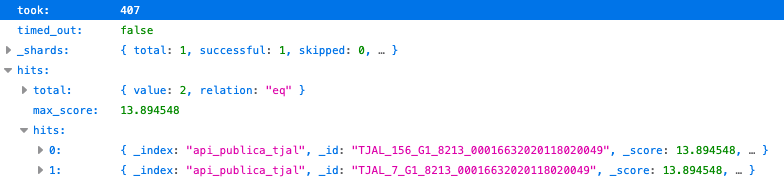
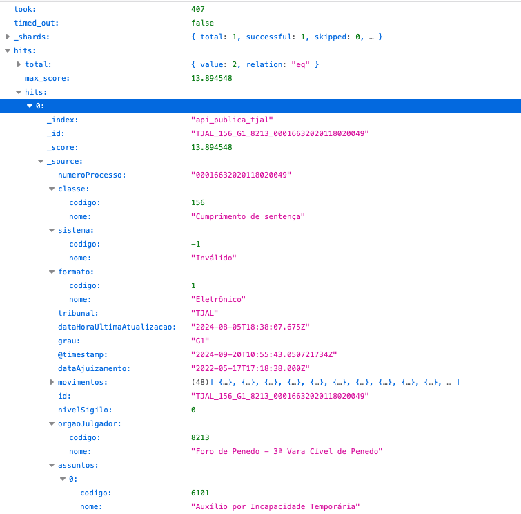
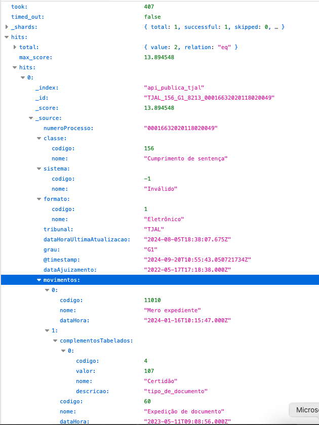

# Análise dos Precatórios Federais

## (esboço de um) Tutorial de uso do Datajud

Então, primeira coisa é que, do jeito que eles organizaram o Datajud, cada Tribunal tem um endpoint próprio:

https://datajud-wiki.cnj.jus.br/api-publica/endpoints

### Bibliotecas

Eu usei R para processar. Carreguei as seguintes bibliotecas:

```r
library(tidyverse)
library(readxl)
library(stringr)
library(httr)
library(jsonlite)
```

### Lista dos números de processos nos quais estou interessado

Primeiro gerei uma lista dos processos cujos detalhes eu queria obter, a partir [desta planilha](./dados/tjdft-Precatorios_Federais___Orcamento_2025.xlsx).

```r
# Prepara lista de processos que serão pesquisados na API -----------------

base_tjdft <- read_excel("./dados/tjdft-Precatorios_Federais___Orcamento_2025.xlsx")

api_endpoint <- "https://api-publica.datajud.cnj.jus.br/api_publica_tjdft/_search"

lista_processos_df <- base_tjdft %>%
  select(`Nome do Tribunal`, `Número da Ação Originária`) %>%
  mutate(
    processo = str_replace_all(`Número da Ação Originária`,
                               "[-.]", 
                               ""
    )
  ) %>%
  distinct()
  
# faz uma string com a lista dos processos, apenas números
# vai ficar uma lista tipo: '"07158804220218070015", "07212835520228070015", "07188796520218070015"'
lista_processos_df_string <- paste0('"', lista_processos_df$processo, '"', collapse = ", ")
```

Então essa `lista_processos_df_string` vai conter uma lista de número de processos do tipo: `"07158804220218070015", "07212835520228070015", "07188796520218070015"`.

### Chamada da API

A chamada da API segue o seguinte formato:

```r
headers <- c(
  'Authorization' = 'ApiKey cDZHYzlZa0JadVREZDJCendQbXY6SkJlTzNjLV9TRENyQk1RdnFKZGRQdw==',
  'Content-Type' = 'application/json'
)

body <- paste0('{
    "size": 10000,
    "query": {
      "terms": {
        "numeroProcesso": [', lista_processos_df_string, '] 
      }
    }
}')

```

Essa `ApiKey` é pública, está disponível aqui: https://datajud-wiki.cnj.jus.br/api-publica/acesso

Veja que nos parâmetros da `query`, estou passando uma lista para o parâmetro `numeroProcesso`, no formato `["07158804220218070015", "07212835520228070015", "07188796520218070015"]`.

Faço então a chamada à API, obtendo um arquivo JSON como resposta:

```r
res <- VERB("POST", url = api_endpoint, body = body, add_headers(headers))

json_response <- content(res, 'text')

```

### Entendendo o arquivo JSON de resposta

Esse arquivo tem o formato seguinte (aqui estou usando o JSON de um pedido de dois processos apenas, para facilitar a visualização):



Veja que os processos propriamente ditos vão estar dentro da chave `hits`, dentro da chave `hits` (pois é 🤷). E, finalmemnte, as várias informações detalhadas do processo estão dentro da chave `_source`:



Lá é possível encontrar classificações usadas pelo Judiciário, bem como todos os movimentos registrados em um determinado processo:



Como estou usando R, preciso converter em um objeto do tipo lista:

```r
parsed_json <- jsonlite::fromJSON(json_response, simplifyVector = FALSE)

hits <- parsed_json$hits$hits #esses são os dados dos processos propriamente ditos
```

### Processando cada registro de processo

Como eu estava interessado em saber quando o processo foi inscrito em precatórios, primeiro defini uma função para procurar um tipo de movimento específico:

```r
get_movement_date <- function(hit_content, target_code) {
  
  # extrai os dados do movimento que corresponde a um determinado tipo de movimento (definido por meio do "target_code")

  for (mov in hit_content$movimentos) {
    if (mov$codigo == target_code) {
      return (mov$dataHora)
    }
  }
  
  return (NA)
  
}
```

Aqui defino uma função que pega o objeto que representa um processo e extrai suas informações num formato tabular

```r
processa_hit <- function(processo) {
  
  #nHits <- nrow(parsed_json$hits$hits)
  
  #print(paste0("Nhits: ", nHits))
  
  #if (nHits > 0) {
  linha <- data.frame(numeroProcesso = c(NA))
  
  linha$numeroProcesso <- processo$numeroProcesso
  
  linha$cod_classe <- as.character(processo$classe$codigo)
  #print(paste("Processamento do hit ", class(linha$cod_classe)))
  
  linha$nome_classe <- processo$classe$nome
  linha$formato <- processo$formato$nome
  linha$grau <- processo$grau
  linha$orgao_julgador_codigo <- processo$orgaoJulgador$codigo
  linha$orgao_julgador_nome <- processo$orgaoJulgador$nome
  
  linha$tribunal <- processo$tribunal
  linha$data_ultima_atualizacao <- processo$dataHoraUltimaAtualizacao
  linha$data_ajuizamento <- processo$dataAjuizamento
  
  nAssuntos <- length(processo$assuntos)
  
  if (!is.null(nAssuntos) & nAssuntos > 0) {
    
    tryCatch(
      
      {
        for (i in 1:nAssuntos) {
          
          linha[1,paste0("cod_assunto",i)] <- as.character(processo$assuntos[[i]]$codigo)
          linha[1,paste0("nome_assunto",i)] <- ifelse(
            is.null(processo$assuntos[[i]]$nome),
            "NULL",
            processo$assuntos[[i]]$nome
          )
          
        }
        
        assuntos <- sapply(processo$assuntos, function(x) x$nome)  # Extract all "nome" fields
        linha$assuntos <- paste(assuntos, collapse = ", ")
        
        NA
        
      },
      
      error = function(cond) {
        print("Erro nos assuntos")
        NA
      }
      
    )
    
  }
  
  nMovimentos <- length(processo$movimentos)
  
  target_code <- 12457 #precatorios
  linha$movimento_inscricao_precatorio <- get_movement_date(processo, target_code)
  
  if (!is.null(nMovimentos)) {
    linha$qde_movimentos <- nMovimentos
    linha$dataPrimeiroMovimento <- processo$movimentos[[1]]$dataHora
    linha$dataultimoMovimento <- processo$movimentos[[nMovimentos]]$dataHora
  }
  
  
  return(linha)
  
  #}
  
}
```

Aqui crio uma outra função que chama a função anterior para cada objeto na lista de processos retornada pela API (dessa forma, vou gerando uma tabela em que cada linha representa os dados de um processo).

```r
processa_parsed_json <- function(parsed_json) {
  
  nHits <- length(parsed_json$hits$hits)
  
  tabela <- data.frame()
  
  if (nHits > 0) {
    
    print(paste(parsed_json$`_shards`$total, parsed_json$`_shards`$successful, nHits))
    
    for (hit in 1:nHits) {
      
      print(hit)
      
      processo <- parsed_json$hits$hits[[hit]]$`_source`
      linha <- processa_hit(processo)#processa_json(processo)
      #print(class(linha$cod_classe))
      tabela <- bind_rows(tabela, linha)
      
    }
    
  } else {
    
    print("Nada.")
    
  }
  
  return(tabela)
  
}

```

Finalmente armazeno essas informações numa tabela e a salvo num arquivo:

```r

tab_df <- processa_parsed_json((parsed_json))
write_rds(tab_df, "./processed/dados-df.rds")

```